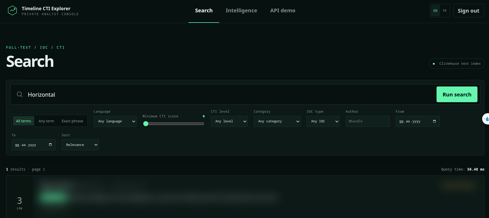
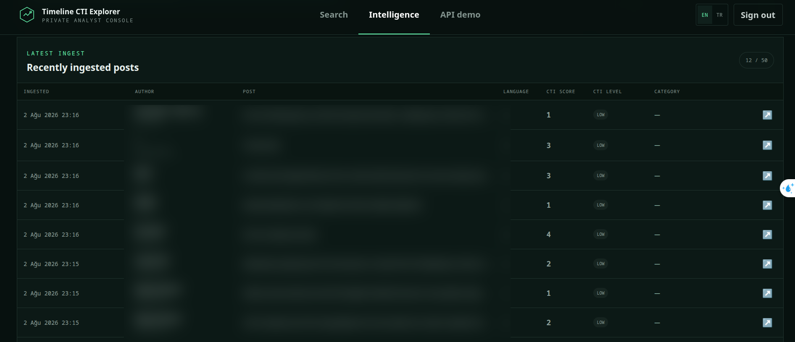
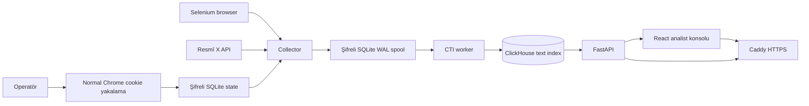
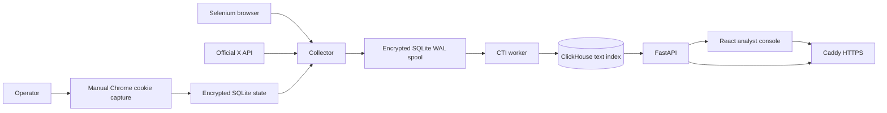
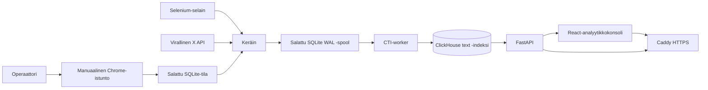

# Timeline CTI Explorer

> Private, explainable cyber-threat-intelligence search across an authenticated X home timeline.

**Prepared and developed by Rojin Delal Dinçer**  
**License:** Apache-2.0  
**Default address:** `https://localhost:8443`

[Türkçe](#türkçe) · [English](#english) · [Suomi](#suomi)

This repository is independent and is not affiliated with, endorsed by, or sponsored by X Corp.
“X” and “Twitter” are trademarks of their respective owner. No real X content, credentials,
cookies, access tokens or browser sessions are distributed with the project.

## Interface preview

### Full-text, IOC and CTI search

<p align="center">
  
</p>

### Intelligence and recently ingested posts

<p align="center">
  
</p>

<p align="center"><sub>Timeline content and account identifiers are blurred in public screenshots.</sub></p>

---

# Türkçe

## Projenin amacı

Timeline CTI Explorer, giriş yapılmış bir X ana sayfa akışındaki postları özel bir ortamda
toplamak, siber tehdit istihbaratı göstergelerini çıkarmak, her kayda açıklanabilir bir CTI skoru
vermek ve sonuçları hızlı biçimde aramak için geliştirilmiş uçtan uca bir sistemdir.

Sistem iki farklı veri toplama yöntemi sunar:

- **Selenium (varsayılan):** Operatörün kendi X oturumuna ait cookie’leri kullanarak Following
  ve For You sekmelerini dönüşümlü tarar.
- **Resmî X API (opsiyonel):** OAuth 2.0 Authorization Code + PKCE ile
  `reverse_chronological` ana sayfa endpoint’ini kullanır.

Toplanan veriler önce AES-256-GCM ile şifreli SQLite WAL kuyruğuna yazılır. Ayrı worker süreci
postları normalize eder, IOC’leri çıkarır, kural ve opsiyonel ONNX model skorunu hesaplar, ardından
ClickHouse’a ekler. FastAPI ve React arayüzü bu özel indekste arama ve analiz sağlar.

> [!IMPORTANT]
> Selenium modu yalnız size ait, giriş yapılmış zaman akışının özel CTI analizi için tasarlanmıştır.
> X’in Hizmet Şartları ve otomasyon politikalarıyla çakışabilir. CAPTCHA, doğrulama veya erişim
> engeli otomatik aşılmaz. Batch Compliance yalnız X API backend’i etkin olduğunda çalışır.

## Başlıca özellikler

- Following ve For You sekmelerini dönüşümlü tarayan Selenium collector.
- Varsayılan 10 dakikalık insan benzeri kaydırma ve yaklaşık 1 saatlik bekleme döngüsü.
- Normal Chrome’da elle giriş; WebDriver yalnız giriş bittikten sonra cookie okumak için bağlanır.
- Cookie, OAuth token ve geçici OAuth state verileri için AES-256-GCM şifreleme.
- ClickHouse erişilemediğinde veri kaybını önleyen kalıcı SQLite WAL spool.
- Post kimliği ve 30 günlük varsayılan seen-cache ile tekrar toplama kontrolü.
- ClickHouse 26.6 yerleşik `text` indeksiyle All, Any ve Phrase araması.
- IPv4, IPv6, domain, URL, e-posta, MD5, SHA-1, SHA-256, SHA-512, CVE, ATT&CK tekniği,
  dosya adı, hashtag ve tehdit aktörü çıkarımı.
- Açıklanabilir kural skoru ve opsiyonel yerel çok dilli ONNX semantik skoru.
- CTI seviyesi, kategori, neden kodu, model revision ve scorer version kaydı.
- Yönetici session cookie’si veya özel Bearer API anahtarıyla korunan FastAPI.
- Arama, CTI dashboard, collector sağlığı ve API örnekleri sunan React analist konsolu.
- Caddy internal CA veya kullanıcı tarafından sağlanan sertifikayla HTTPS.
- Prometheus ve Grafana için opsiyonel gözlemlenebilirlik profili.
- Deterministik sentetik veri üreticisi ve k6 performans testi.
- Ayrı ClickHouse admin, salt-okunur API ve ingest kullanıcıları.
- Yerleşik ClickHouse backup/restore akışı.

## Mimari



### Bileşenler

- **Caddy:** Host üzerinde dışarı açılan tek servistir. HTTPS sonlandırma, frontend, API ve
  opsiyonel Grafana yönlendirmesini yapar.
- **API:** Oturum, CSRF, API key, arama, post detayı, CTI, istatistik ve collector durum
  endpoint’lerini sunar.
- **Collector:** Seçilen backend’den veriyi alır; günlük bütçe, spool limiti, tekrar kontrolü,
  backoff ve audit kaydı uygular.
- **Browser:** İzole Selenium/Chromium servisidir. Host portu yayınlamaz.
- **Worker:** Spool kayıtlarını CTI açısından zenginleştirir ve ClickHouse’a batch olarak yazar.
- **ClickHouse:** Post, IOC, skor ve arama indekslerini saklar.
- **Model init:** Sabit revision modelini indirir, ONNX’e aktarır, dinamik int8 quantization
  uygular ve SHA-256 manifesti üretir.
- **Prometheus/Grafana:** Opsiyonel operasyon metrikleri sağlar. Grafana datasource otomatik
  hazırlanır; hazır dashboard dağıtılmaz.

## Gereksinimler

- Docker Engine 28 veya üzeri.
- Docker Compose 2.40 veya üzeri.
- Secret bootstrap ve cookie yardımcı aracı için Python 3.12 veya üzeri.
- Cookie yakalamak için Google Chrome veya Chromium.
- Küçük bir demo için en az 8 GiB RAM.
- Varsayılan Compose limitleri 12 çekirdek/32 GiB referans makineyi hedefler. Daha küçük
  sistemlerde `CLICKHOUSE_MEMORY_LIMIT` ve servis limitlerini düşürün.

## Hızlı kurulum

```bash
python3 -m venv .venv
. .venv/bin/activate
python -m pip install -e '.[browser]'
python scripts/bootstrap_env.py
docker compose config --quiet
docker compose up -d --build
```

`bootstrap_env.py`:

- en az 16 karakterlik yönetici parolasını echo etmeden ister;
- yalnız Argon2id hash’ini saklar;
- session secret, 32 baytlık AES anahtarı ve API key üretir;
- ClickHouse admin/API/ingest parolalarını ayrı üretir;
- Grafana yönetici parolası üretir;
- `.env` dosyasını `0600` izniyle yazar;
- özel API anahtarını yalnız bir kez terminale basar.

Anahtarları güvenli bir parola yöneticisine kaydedin. `.env` dosyasını Git’e eklemeyin.

## HTTPS ve yerel CA

Varsayılan adres:

```text
https://localhost:8443
```

Caddy internal CA sertifikasını dışa aktarmak ve işletim sistemine güvenilir olarak eklemek için:

```bash
./scripts/export_local_ca.sh
./scripts/trust_local_ca.sh
```

Firefox ve kurumsal tarayıcılar ayrı trust store kullanabilir; bu durumda
`timeline-cti-local-ca.crt` dosyasını elle içe aktarın. Production’da `TLS_MODE=files` ile kendi
sertifika ve private key dosyalarınızı mount edebilirsiniz.

## Selenium collector kurulumu

### 1. Servisleri başlatın

```bash
docker compose up -d --build
```

### 2. X oturumunu elle açıp cookie’leri alın

```bash
. .venv/bin/activate
python host_files/capture_x_cookies.py --import-docker
```

Yardımcı araç:

1. `host_files/chrome-profile` altında ayrı ve kalıcı bir Chrome profili açar.
2. X ana sayfasını normal Chrome sürecinde gösterir.
3. Kullanıcı adı, parola, MFA ve varsa X doğrulamasını tamamen size bırakır.
4. `/home` açıldığını otomatik algılar.
5. WebDriver’ı yalnız bu aşamadan sonra cookie okumak için bağlar.
6. `auth_token` ve `ct0` cookie’lerini `host_files/x_cookies.json` dosyasına yazar.
7. `--import-docker` kullanıldığında cookie’leri collector içindeki şifreli state store’a aktarır.

Ham cookie dosyası `.gitignore` kapsamındadır ve `0600` izniyle oluşturulur; şifreli içe aktarma
tamamlandıktan sonra ek güvenlik için silebilirsiniz.

Manuel içe aktarma:

```bash
sudo docker compose exec -T collector \
  timeline-cti-cli import-cookies - < host_files/x_cookies.json
docker compose restart collector
```

Collector daha önce oturum beklerken uykuya girdiyse import sonrasında restart etmek yeni oturumun
hemen kullanılmasını sağlar.

### Selenium davranışı

- `following` ve `for_you` seçimi SQLite state içinde tutulur ve her turda değiştirilir.
- Varsayılan kaydırma süresi `SELENIUM_SCROLL_SECONDS=600` saniyedir.
- Varsayılan bekleme `SELENIUM_IDLE_SECONDS=3600` saniye ve en fazla 120 saniye jitter’dır.
- Kaydırma mesafesi viewport’un değişken bir bölümüdür; ara sıra kısa geri kaydırma ve değişken
  okuma beklemeleri kullanılır.
- Oturum login veya X verification sayfasına düşerse collector işlemi zorlamaz; açık hata kaydeder
  ve yeni manuel oturum bekler.
- `SELENIUM_SEEN_RETENTION_DAYS=30` boyunca görülen post kimlikleri tekrar kuyruğa alınmaz.
- DOM’dan konuşma ve yazarın sayısal kimliği güvenilir alınamadığı için bu alanlar boş olabilir.
- Selenium modu, oturum sahibinin görebildiği içeriği işler; DOM korumalı-yazar durumunu güvenilir
  ayıramadığı için API backend’indeki protected-author filtresiyle aynı garantiye sahip değildir.
- Medya binary dosyaları indirilmez.

## Resmî X API collector kurulumu

`.env` içinde:

```dotenv
COLLECTOR_BACKEND=api
X_USE_CASE_APPROVED=true
X_CLIENT_ID=...
X_CLIENT_SECRET=...
X_BEARER_TOKEN=...
X_REDIRECT_URI=https://localhost:8443/api/v1/auth/x/callback
```

Adımlar:

1. CTI kullanım amacını X Developer Console’da beyan edin ve gerekli onayı alın.
2. OAuth callback adresini birebir kaydedin.
3. Yalnız `tweet.read`, `users.read` ve `offline.access` scope’larını isteyin.
4. Servisleri yeniden başlatın.
5. Web arayüzünde yönetici olarak giriş yapıp **Connect X with OAuth 2.0** bağlantısını kullanın.

API backend’i `/2/users/{id}/timelines/reverse_chronological` endpoint’ini kullanır. X’in mevcut
sınırları nedeniyle bu kaynak son 3.200 post veya yedi günlük pencereyle sınırlıdır; firehose
değildir. Pagination, `since_id`, access-token refresh, rate-limit reset, exponential backoff ve
günlük okuma bütçesi uygulanır.

Yaklaşık 23 saatte bir Batch Compliance işi açılır; post ID’leri yüklenir, silme olayları indirilir
ve eşleşen ClickHouse kayıtları lightweight delete ile kaldırılır. Bu mekanizma Selenium backend’i
çalışırken devre dışıdır.

## Toplama, kuyruk ve hata dayanıklılığı

- Varsayılan günlük okuma bütçesi `X_DAILY_READ_BUDGET=10000` değeridir ve collector tarafından
  backend’den bağımsız sayaç olarak kullanılır.
- Spool varsayılan limiti 512 MiB’tır (`SPOOL_MAX_BYTES=536870912`).
- Spool payload’ları AES-256-GCM ile şifrelenir.
- SQLite `WAL`, `synchronous=FULL`, foreign keys ve busy timeout kullanır.
- `source_id` unique olduğu için aynı post spool’a iki kez eklenmez.
- Worker başarılı batch’i acknowledge eder; hata halinde kayıtları gecikmeli retry durumuna alır.
- Audit tablosu login, OAuth, collector, compliance ve session güncelleme olaylarını saklar.
- Loglar post metni, cookie, token veya özel API anahtarı yazmaz.

## CTI motoru

### IOC normalizasyonu ve çıkarımı

Analizden önce Unicode NFKC + casefold uygulanır. Yaygın etkisizleştirme biçimleri analiz için
refang edilir: `hxxp://`, `hxxps://`, `[.]`, `(.)`, `[:]` ve `[@]`.

Çıkarılan gösterge türleri:

- IPv4 ve IPv6;
- domain ve URL;
- e-posta;
- MD5, SHA-1, SHA-256 ve SHA-512;
- `CVE-YYYY-NNNN` biçimindeki CVE’ler;
- `T1234` ve `T1234.001` biçimindeki MITRE ATT&CK teknikleri;
- yürütülebilir, script, arşiv ve macro-enabled belge dosya adları;
- hashtag;
- `APT`, `UNC`, `FIN` ve `TA` kalıplarındaki tehdit aktörü adları.

### Açıklanabilir kural skoru

Toplam kural skoru 100 ile sınırlandırılır:

- IOC kanıtı: en fazla 45.
- CVE ve ATT&CK referansı: en fazla 20.
- Malware, phishing, ransomware, vulnerability ve APT/campaign bağlamı: en fazla 20.
- `CTI_TRUSTED_HANDLES` içindeki açıkça güvenilen kaynak: 10.
- Logaritmik normalize edilmiş engagement: en fazla 5.

Varsayılan seviyeler:

- `low`: 0–39
- `medium`: 40–69
- `high`: 70–84
- `critical`: 85–100

Eşikler `.env` üzerinden değiştirilebilir ve daima artan sırada olmak zorundadır.

### Semantik skor

Opsiyonel model kullanılabiliyorsa:

```text
final_score = 0.65 × rule_score + 0.35 × semantic_score
```

Model yoksa veya checksum/revision doğrulaması başarısızsa sistem veri kaybetmez; skor
`rules_only` modunda üretilir ve `semantic_model:unavailable` neden kodu saklanır. Eksik model
sessizce sıfır skor sayılmaz.

Modeli hazırlamak için:

```bash
docker compose --profile ml run --rm model-init
docker compose restart worker
```

Model init, `.env` içindeki exact revision’ı indirir, CPU ONNX çıktısı üretir, dinamik int8
quantization uygular ve manifest SHA-256 değerini basar. Production’da bu değeri
`CTI_MODEL_SHA256` olarak pinleyin. X içeriği model eğitimi veya fine-tuning için kullanılmaz.

## ClickHouse veri modeli

`posts` tablosu:

- `ReplacingMergeTree(content_version)` kullanır;
- `created_at` ayına göre partition edilir;
- `(toDate(created_at), post_id)` ile sıralanır;
- metin, yazar, zaman, dil, engagement, referans, IOC ve CTI alanlarını birlikte saklar;
- kullanıcı sorgularında `FINAL` kullanarak eski/yeni content version çiftlerini gizler;
- `normalized_text` üzerinde ClickHouse native `text` index taşır;
- yazar ve CTI kategori alanlarında bloom filter indeksleri kullanır.

Günlük CTI seviyeleri için `daily_cti_stats` ve materialized view bulunur. Projection bilinçli
olarak kullanılmaz; lightweight compliance delete doğruluğu önceliklidir.

## Arama

Arama modları:

- `all`: bütün tokenlar bulunmalıdır (`hasAllTokens`).
- `any`: tokenlardan en az biri bulunmalıdır (`hasAnyTokens`).
- `phrase`: tam ifade bulunmalıdır (`hasPhrase`).

Filtreler:

- tarih başlangıcı ve bitişi;
- dil;
- yazar kullanıcı adı;
- minimum CTI skoru;
- CTI seviyesi;
- CTI kategorisi;
- IOC türü: IP, domain, URL, hash, CVE veya ATT&CK.

Sıralama:

- `newest`;
- `cti`;
- `relevance` — mevcut uygulamada CTI skoru ve tarih önceliklidir.

Sorgu en az 3, en fazla 256 karakter ve en fazla 5 anlamlı terim olabilir. Regex, arbitrary
substring ve leading wildcard sorguları desteklenmez. Sayfa boyutu en fazla 100’dür. Pagination,
server-side imzalanan opaque cursor kullanır.

## Özel API

Başlıca endpoint’ler:

- `GET /api/v1/health/live`
- `GET /api/v1/health/ready`
- `POST /api/v1/auth/login`
- `POST /api/v1/auth/logout`
- `GET /api/v1/auth/session`
- `GET /api/v1/auth/x/start`
- `GET /api/v1/auth/x/callback`
- `GET /api/v1/search`
- `GET /api/v1/posts/recent`
- `GET /api/v1/posts/{post_id}`
- `GET /api/v1/cti/top`
- `GET /api/v1/stats/overview`
- `GET /api/v1/collector/status`
- `POST /api/v1/collector/run`
- `GET /api/docs`
- `GET /api/openapi.json`

Başarılı cevaplar `{data, meta, error}` envelope’u kullanır. Hatalar
`application/problem+json` biçimindedir. Arama sonuçları eşleşme highlight offset’lerini,
metrikleri, IOC’leri, CTI nedenlerini ve orijinal post bağlantısını içerir.

API key örneği:

```bash
curl --cacert timeline-cti-local-ca.crt \
  'https://localhost:8443/api/v1/search?q=CVE-2026-4242&mode=all&cti_min=70&limit=20' \
  -H 'Authorization: Bearer <PRIVATE_API_KEY>'
```

Swagger UI, web oturumundan sonra `https://localhost:8443/api/docs` adresindedir.

`POST /api/v1/collector/run` mevcut sürümde yalnız `collector_run_requested` audit/state kaydı
oluşturur; collector bu bayrağı henüz tüketmediği için anlık bir toplama turu başlatmaz.

`/api/v1/health/ready`, ClickHouse bağlantısına ek olarak worker’ın `hybrid` scoring modunda
olmasını ister. Opsiyonel model kurulmamışsa servis çalışmaya ve `rules_only` skor üretmeye devam
eder, ancak readiness bilinçli olarak `503 degraded` döner.

## Web arayüzü

React 19, TypeScript, Vite, TanStack Query ve i18next kullanır.

- **Search:** All/Any/Phrase seçimi, tarih, dil, yazar, CTI, IOC ve sıralama filtreleri.
- **Intelligence:** Toplam post, high/critical sinyal, son ingest, 30 günlük zaman çizgisi,
  kategori dağılımı, IOC özeti ve yüksek öncelikli sinyaller.
- **Collector health:** Backend, browser session/OAuth, compliance, spool, günlük bütçe,
  rate-limit, scoring mode, son başarı ve son hata bilgileri.
- **API demo:** Kopyalanabilir cURL ve JSON örnekleri ile korumalı OpenAPI bağlantısı.

Arayüzün temel kullanıcı metinleri **İngilizce ve Türkçe** sunulur; bazı teknik etiketler ve filtre
değerleri İngilizce kalır. Dil seçimi tarayıcı `localStorage` alanında tutulur ve mevcut sürümde
`DEFAULT_LOCALE` environment değeri frontend seçimini değiştirmez. Bu README ayrıca Fince
hazırlanmıştır; Fince README bölümü arayüzde Fince lokalizasyon bulunduğu anlamına gelmez.

## Yapılandırma

Uygulama `config.json` okumaz. Docker Compose `.env` değerlerini process environment olarak geçirir.

- **Uygulama:** `APP_ENV`, `APP_HOSTNAME`, `HTTPS_PORT`, `DEFAULT_LOCALE`, `ALLOWED_ORIGINS`,
  `LOG_LEVEL`.
- **TLS:** `TLS_MODE`, `TLS_CERT_FILE`, `TLS_KEY_FILE`.
- **Kimlik doğrulama:** `ADMIN_PASSWORD_HASH`, `SESSION_SECRET`, `TOKEN_ENCRYPTION_KEY`,
  `API_KEY_SHA256`, `SESSION_MAX_AGE_SECONDS`.
- **ClickHouse:** `CLICKHOUSE_*`, `QUERY_TIMEOUT_SECONDS`.
- **State/spool:** `STATE_DATABASE_PATH`, `SPOOL_MAX_BYTES`.
- **Collector:** `COLLECTOR_BACKEND`, `X_DAILY_READ_BUDGET`.
- **Selenium:** `SELENIUM_REMOTE_URL`, `SELENIUM_SCROLL_SECONDS`, `SELENIUM_IDLE_SECONDS`,
  `SELENIUM_IDLE_JITTER_SECONDS`, `SELENIUM_SEEN_RETENTION_DAYS`, `SELENIUM_LOCALE`,
  `SELENIUM_TIMEZONE`.
- **X API:** `X_CLIENT_ID`, `X_CLIENT_SECRET`, `X_BEARER_TOKEN`, `X_REDIRECT_URI`,
  `X_POLL_SECONDS`, `X_USE_CASE_APPROVED`.
- **CTI/model:** `CTI_*`.
- **Backup:** `BACKUP_TARGET`.

Production validation weak/placeholder secret’ları reddeder, Argon2id maliyetini doğrular ve
pinlenmiş model SHA-256 ister.

## Güvenlik, gizlilik ve uyumluluk

- Caddy, host portu yayınlayan tek servistir.
- API, collector, worker, ClickHouse ve Prometheus internal networklerde çalışır.
- Browser ve collector outbound erişim için ayrı `egress` ağı kullanır.
- Container’lar mümkün olan yerde non-root, read-only filesystem, dropped capability ve
  `no-new-privileges` kullanır.
- Yönetici session cookie’si `Secure`, `HttpOnly`, `SameSite=Strict` özelliklidir.
- Session tabanlı state-changing isteklerde CSRF doğrulaması yapılır.
- Parola Argon2id ile doğrulanır; API key’in yalnız SHA-256 özeti saklanır.
- OAuth state tek kullanımlık ve süre sınırlıdır.
- Cookie ve OAuth tokenları AES-256-GCM ile şifrelenir.
- CORS allow-list, request ID, login/search rate limit ve imzalı cursor kullanılır.
- Anonim arama ve bulk full-text export sunulmaz.
- Gerçek X içeriği fixture veya demo olarak dağıtılmaz.

Ayrıntılar: [SECURITY.md](SECURITY.md), [PRIVACY.md](PRIVACY.md),
[COMPLIANCE.md](COMPLIANCE.md).

## Gözlemlenebilirlik

```bash
docker compose --profile observability up -d
```

Prometheus internal metrics endpoint’ini toplar. Grafana doğrudan host portu yayınlamaz; Caddy
üzerinden `/grafana/` altında sunulur. Yalnız Prometheus datasource’u provision edilir; hazır
Grafana dashboard’u yoktur. Collector ve worker logları yapılandırılmış olay adı, request ID,
sayaç ve hata türü içerir; hassas post metni veya secret içermez.

## Sentetik veri ve benchmark

Varsayılan bir milyon deterministik sentetik kayıt:

```bash
ROWS=1000000 make benchmark
```

Üretici Python satır döngüsü yerine ClickHouse `numbers()` ve server-side `INSERT SELECT` kullanır.
Gerçek X içeriği benchmark verisi değildir.

k6:

```bash
BASE_URL=https://localhost:8443 API_KEY='<PRIVATE_API_KEY>' \
  k6 run benchmarks/query-suite.js
```

Referans kabul profili:

- 12 CPU çekirdeği, 32 GiB RAM, 1 TB 7200 RPM HDD;
- 100 milyon sentetik post;
- 10 eşzamanlı kullanıcı;
- 5 dakika warm-up ve 30 dakika ölçüm;
- token p95 hedefi 1 saniyenin altında;
- phrase p95 hedefi 2 saniyenin altında;
- hata oranı hedefi `%0,1` altında.

Bu referans testi henüz çalıştırılmadı. `benchmarks/results/not-run.json` doğrulanmamış durumu
bilinçli biçimde kaydeder. Ölçüm yapılmadan performans sonucu iddia edilmemelidir.

## Operasyon

```bash
docker compose ps
docker compose logs -f --tail=200
docker compose restart collector
docker compose restart worker
docker compose exec clickhouse \
  clickhouse-client --query 'SELECT count() FROM timeline_cti.posts'
docker compose down
```

Diskte en az `%20` boş alan bırakın. Bu deployment tek node’dur ve high availability sağlamaz.

## Backup ve restore

`BACKUP_TARGET` değerini şifreli bir haricî dosya sistemine yönlendirin:

```bash
docker compose stop collector worker
docker compose exec clickhouse clickhouse-client --user admin --ask-password \
  --query "BACKUP DATABASE timeline_cti TO Disk('backups', 'timeline_cti_$(date +%Y%m%d)')"
docker compose start worker collector
```

Her backup’ı disposable veritabanında test edin:

```sql
RESTORE DATABASE timeline_cti AS timeline_cti_restore_test
FROM Disk('backups', 'timeline_cti_YYYYMMDD');
SELECT count() FROM timeline_cti_restore_test.posts;
DROP DATABASE timeline_cti_restore_test;
```

Off-host kopya ve düzenli restore tatbikatı olmadan backup tamamlanmış sayılmamalıdır.

## Yönetim CLI’ı

```bash
timeline-cti-cli generate-secrets
timeline-cti-cli hash-password '<PAROLA>'
timeline-cti-cli hash-api-key '<API_KEY>'
timeline-cti-cli import-cookies host_files/x_cookies.json
```

## Geliştirme ve test

Backend:

```bash
python -m pip install -e '.[dev,browser]'
pytest --cov=timeline_cti --cov-report=term-missing
ruff check backend tests host_files
mypy backend
bandit -q -r backend
pip-audit
```

Frontend:

```bash
cd frontend
corepack pnpm install --frozen-lockfile
corepack pnpm run typecheck
corepack pnpm run lint
corepack pnpm run build
corepack pnpm audit --audit-level high
```

## Bilinen sınırlar

- Selenium DOM selector’ları X arayüz değişikliklerinden etkilenebilir.
- Selenium modu CAPTCHA veya doğrulama çözmez; yeni manuel oturum gerekir.
- Selenium’da bazı API’ye özel metadata alanları boş veya sınırlı olabilir.
- API ana sayfa endpoint’i firehose değildir.
- Mevcut Compose topolojisinde API backend seçilse bile collector `browser` health bağımlılığını
  korur ve browser servisi başlatılır.
- `/api/v1/collector/run` henüz collector döngüsünü anlık uyandırmaz.
- ONNX modeli olmadan `/health/ready` degraded döner; veri işleme `rules_only` devam eder.
- API rate limiter tek process belleğindedir ve birden çok API replikası arasında paylaşılmaz.
- Frontend için otomatik component/E2E test paketi yoktur; typecheck, lint ve production build
  doğrulanır.
- Tek node ClickHouse high availability sağlamaz.
- Semantik model opsiyoneldir; model olmadan yalnız kural skoru üretilir.
- Arayüz EN/TR’dir; Fince yalnız bu README’de sunulur.
- 100M referans benchmark sonucu henüz ölçülmemiştir.
- Bulk full-text export ve anonim erişim bilinçli olarak yoktur.

## Hazırlayan

**Rojin Delal Dinçer**  
Designed and developed by Rojin Delal Dinçer.

---

# English

## Purpose

Timeline CTI Explorer is an end-to-end system for collecting posts from an authenticated X home
timeline in a private environment, extracting cyber-threat-intelligence indicators, assigning an
explainable CTI score to each record and searching the resulting index efficiently.

It supports two ingestion methods:

- **Selenium (default):** Uses cookies from the operator’s own X session and alternates between
  the Following and For You tabs.
- **Official X API (optional):** Uses OAuth 2.0 Authorization Code + PKCE and the
  `reverse_chronological` home-timeline endpoint.

Collected data first enters an AES-256-GCM-encrypted SQLite WAL spool. A separate worker normalizes
posts, extracts IOCs, calculates rule and optional ONNX semantic scores, and inserts the enriched
records into ClickHouse. A private FastAPI service and React console provide search and analysis.

> [!IMPORTANT]
> Selenium mode is intended only for private CTI analysis of your own authenticated timeline. It
> may conflict with X Terms of Service or automation policies. The project does not automate
> CAPTCHA, verification or access-control bypass. Batch Compliance runs only with the X API backend.

## Main features

- Selenium collection alternating between Following and For You.
- Human-paced scrolling for 10 minutes followed by an approximately one-hour idle period.
- Manual login in normal Chrome; WebDriver attaches only after login to read cookies.
- AES-256-GCM encryption for browser cookies, OAuth tokens and temporary OAuth state.
- Durable SQLite WAL spool for ClickHouse outages.
- Source-ID and retained seen-post deduplication.
- ClickHouse 26.6 native `text` index with All, Any and Phrase search.
- Extraction of IPv4, IPv6, domains, URLs, e-mail, hashes, CVEs, ATT&CK techniques, filenames,
  hashtags and threat-actor identifiers.
- Explainable rule scoring with optional local multilingual ONNX inference.
- Persisted CTI level, categories, reason codes, scorer version and model revision.
- FastAPI protected by an administrator session or private Bearer API key.
- React analyst console for search, intelligence overview, collector health and API examples.
- HTTPS through Caddy internal CA or mounted production certificates.
- Optional Prometheus and Grafana profile.
- Deterministic synthetic data generator and k6 benchmark.
- Separate ClickHouse administrator, read-only API and ingest identities.
- Built-in ClickHouse backup and restore workflow.

## Architecture



### Components

- **Caddy:** The only host-facing service. Terminates HTTPS and routes the frontend, API and
  optional Grafana UI.
- **API:** Provides authentication, search, post detail, CTI, statistics and collector-status APIs.
- **Collector:** Reads from the selected backend and enforces budget, spool limit, deduplication,
  backoff and audit records.
- **Browser:** Isolated Selenium/Chromium service without a published host port.
- **Worker:** Enriches queued payloads and writes ClickHouse batches.
- **ClickHouse:** Stores posts, indicators, scores and search indexes.
- **Model init:** Downloads an exact model revision, exports ONNX, applies dynamic int8
  quantization and creates a SHA-256 manifest.
- **Prometheus/Grafana:** Optional operational metrics. The Grafana datasource is provisioned,
  but no ready-made dashboards are shipped.

## Requirements and quick start

- Docker Engine 28+ and Docker Compose 2.40+.
- Python 3.12+.
- Google Chrome or Chromium for cookie capture.
- At least 8 GiB RAM for a small demo. The default limits target a 12-core/32-GiB host.

```bash
python3 -m venv .venv
. .venv/bin/activate
python -m pip install -e '.[browser]'
python scripts/bootstrap_env.py
docker compose config --quiet
docker compose up -d --build
```

The bootstrap helper asks for a 16+ character administrator password without echoing it, stores
only an Argon2id hash, creates independent application and ClickHouse secrets, writes `.env` with
mode `0600`, and prints the private API key exactly once.

Open `https://localhost:8443`.

## TLS and local CA

```bash
./scripts/export_local_ca.sh
./scripts/trust_local_ca.sh
```

Firefox or managed browsers may require manual import of `timeline-cti-local-ca.crt`. Production
deployments can set `TLS_MODE=files` and mount their own certificate and key.

## Selenium setup

Start the stack, then capture and import the session:

```bash
docker compose up -d --build
. .venv/bin/activate
python host_files/capture_x_cookies.py --import-docker
docker compose restart collector
```

The helper opens normal Chrome with a dedicated persistent profile under
`host_files/chrome-profile`. You complete credentials, MFA and X verification manually. Once
`/home` is visible, WebDriver attaches only to read cookies. The helper requires `auth_token` and
`ct0`, writes `host_files/x_cookies.json` with mode `0600`, and imports the session into encrypted
SQLite state. The raw file is Git-ignored and may be deleted after import.

Manual import:

```bash
sudo docker compose exec -T collector \
  timeline-cti-cli import-cookies - < host_files/x_cookies.json
docker compose restart collector
```

### Selenium behavior

- Alternates the persisted `following` and `for_you` state.
- Scrolls for `SELENIUM_SCROLL_SECONDS=600` by default.
- Sleeps for `SELENIUM_IDLE_SECONDS=3600` plus up to 120 seconds of jitter.
- Uses variable viewport-relative movement, dwell periods and occasional short reverse scrolls.
- Stops and reports a clear error on login or verification pages.
- Retains seen post IDs for 30 days by default.
- Leaves API-only numeric author and conversation metadata empty when unavailable in the DOM.
- Does not download media binaries.
- Processes content visible to the authenticated operator. The DOM cannot reliably identify
  protected-author state, so Selenium does not offer the API backend’s protected-author guarantee.

## Official X API setup

```dotenv
COLLECTOR_BACKEND=api
X_USE_CASE_APPROVED=true
X_CLIENT_ID=...
X_CLIENT_SECRET=...
X_BEARER_TOKEN=...
X_REDIRECT_URI=https://localhost:8443/api/v1/auth/x/callback
```

Register and obtain approval for the CTI use case, configure the exact callback URL, request only
`tweet.read`, `users.read` and `offline.access`, restart the API and collector, then use the web
console’s OAuth connection.

The API backend implements pagination, `since_id`, token refresh, rate-limit reset, exponential
backoff and the daily read budget. X limits the endpoint to the most recent 3,200 posts or seven
days; it is not a firehose.

Batch Compliance runs approximately every 23 hours in API mode. It submits stored post IDs,
downloads deletion events and removes matching ClickHouse rows with lightweight deletes.

## Durable collection pipeline

- Default daily budget: 10,000 post reads.
- Default encrypted spool limit: 512 MiB.
- SQLite uses WAL, `synchronous=FULL`, foreign keys and a busy timeout.
- Unique source IDs prevent duplicate spool rows.
- Successful worker batches are acknowledged; failed batches receive delayed retries.
- Audit events cover login, OAuth, collector, compliance and browser-session updates.
- Structured logs contain event names, counters and error types—not post text or secrets.

## CTI processing

Text is normalized with Unicode NFKC and case folding. Common defanged forms such as `hxxp://`,
`hxxps://`, `[.]`, `(.)`, `[:]` and `[@]` are refanged for analysis.

Extracted indicators:

- IPv4 and IPv6;
- domains and URLs;
- e-mail addresses;
- MD5, SHA-1, SHA-256 and SHA-512;
- CVE identifiers;
- MITRE ATT&CK techniques and sub-techniques;
- executable, script, archive and macro-document filenames;
- hashtags;
- common APT, UNC, FIN and TA actor identifiers.

### Explainable score

The rule score is capped at 100:

- IOC evidence: up to 45.
- CVE and ATT&CK references: up to 20.
- Malware, phishing, ransomware, vulnerability and campaign context: up to 20.
- Explicitly trusted handle: 10.
- Log-normalized engagement: up to 5.

Default levels are `low` 0–39, `medium` 40–69, `high` 70–84 and `critical` 85–100.

When the model is available:

```text
final_score = 0.65 × rule_score + 0.35 × semantic_score
```

Without a valid model, processing continues in explicit `rules_only` mode. Missing inference is
never silently converted to zero.

## Optional semantic model

```bash
docker compose --profile ml run --rm model-init
docker compose restart worker
```

The initializer downloads the configured exact revision, exports a CPU ONNX model, applies dynamic
int8 quantization and writes a SHA-256 manifest. Pin the resulting digest as
`CTI_MODEL_SHA256` in production. X content is never used for training or fine-tuning.

## ClickHouse storage and search

The `posts` table uses monthly partitions and `ReplacingMergeTree(content_version)`, ordered by
creation date and post ID. User-facing reads use `FINAL` to hide unmerged content versions. The
schema stores text, author, timestamps, language, engagement, references, all IOC arrays and the
full CTI assessment.

`normalized_text` uses the ClickHouse native `text` index. Search calls `hasAllTokens`,
`hasAnyTokens` or `hasPhrase` with typed bound parameters. Author and CTI category fields use
bloom-filter indexes. A materialized view maintains daily CTI-level statistics.

Search supports date, language, author, minimum score, level, category and IOC-type filters.
Queries are 3–256 characters with at most five meaningful terms. Regex, arbitrary substring and
leading-wildcard queries are intentionally unsupported. Results use signed opaque cursors and a
maximum page size of 100.

## API

Key routes:

- health: `/api/v1/health/live`, `/api/v1/health/ready`;
- authentication: `/api/v1/auth/login`, `/logout`, `/session`, `/x/start`, `/x/callback`;
- data: `/api/v1/search`, `/api/v1/posts/recent`, `/api/v1/posts/{post_id}`, `/api/v1/cti/top`;
- operations: `/api/v1/stats/overview`, `/api/v1/collector/status`, `/collector/run`;
- protected documentation: `/api/docs`, `/api/openapi.json`.

Success responses use `{data, meta, error}`. Errors use `application/problem+json`. Search results
include highlight offsets, metrics, IOCs, CTI reasons and a source URL.

`POST /api/v1/collector/run` currently records a `collector_run_requested` state/audit event only.
The collector does not consume that flag yet, so the endpoint does not start an immediate cycle.

`/api/v1/health/ready` requires both ClickHouse connectivity and worker `hybrid` scoring mode.
Without the optional model, ingestion continues safely in `rules_only` mode while readiness
intentionally returns `503 degraded`.

```bash
curl --cacert timeline-cti-local-ca.crt \
  'https://localhost:8443/api/v1/search?q=CVE-2026-4242&mode=all&cti_min=70&limit=20' \
  -H 'Authorization: Bearer <PRIVATE_API_KEY>'
```

## Analyst console

The React 19/TypeScript/Vite application provides:

- a rich full-text search workspace;
- an intelligence dashboard with totals, 30-day timeline, categories and IOC summary;
- prioritized high-CTI cards with explainability;
- collector, queue, compliance, budget and model health;
- API examples and protected Swagger UI.

The main application copy supports **English and Turkish**; some technical labels and filter values
remain in English. Language selection is stored in browser `localStorage`, and the current frontend
does not derive it from the `DEFAULT_LOCALE` environment value. Finnish is provided for this
README, not as a claim of Finnish UI localization.

## Configuration groups

- Application: `APP_ENV`, `APP_HOSTNAME`, `HTTPS_PORT`, `DEFAULT_LOCALE`, `ALLOWED_ORIGINS`,
  `LOG_LEVEL`.
- TLS: `TLS_MODE`, `TLS_CERT_FILE`, `TLS_KEY_FILE`.
- Authentication: `ADMIN_PASSWORD_HASH`, `SESSION_SECRET`, `TOKEN_ENCRYPTION_KEY`,
  `API_KEY_SHA256`, `SESSION_MAX_AGE_SECONDS`.
- ClickHouse and query timeout: `CLICKHOUSE_*`, `QUERY_TIMEOUT_SECONDS`.
- State and spool: `STATE_DATABASE_PATH`, `SPOOL_MAX_BYTES`.
- Collector and budget: `COLLECTOR_BACKEND`, `X_DAILY_READ_BUDGET`.
- Selenium: `SELENIUM_*`.
- Official API: `X_*`.
- CTI and model: `CTI_*`.
- Backup: `BACKUP_TARGET`.

Configuration is loaded only from process environment. Production validation rejects weak
placeholders, validates Argon2id cost parameters and requires a pinned model checksum.

## Security, privacy and compliance

- Only Caddy publishes a host port.
- Internal services remain on isolated Docker networks.
- Browser and collector use a dedicated egress network for outbound access.
- Containers use non-root execution where supported, read-only filesystems, dropped capabilities
  and `no-new-privileges`.
- Administrator cookies are `Secure`, `HttpOnly` and `SameSite=Strict`.
- Session mutations require CSRF validation.
- Passwords use Argon2id; only the API-key SHA-256 digest is stored.
- Browser cookies and OAuth tokens are AES-256-GCM encrypted.
- OAuth state is one-time and expires.
- CORS allow-lists, request IDs, rate limits and signed cursors are enforced.
- Anonymous search and bulk full-text export are not implemented.
- Real X content is never shipped as a fixture or demo.

Read [SECURITY.md](SECURITY.md), [PRIVACY.md](PRIVACY.md) and
[COMPLIANCE.md](COMPLIANCE.md).

## Observability

```bash
docker compose --profile observability up -d
```

Prometheus scrapes internal metrics. Grafana is available only through Caddy at `/grafana/`; it
does not publish a separate host port. Only the Prometheus datasource is provisioned; the
repository does not ship a prebuilt Grafana dashboard.

## Synthetic benchmark

```bash
ROWS=1000000 make benchmark
BASE_URL=https://localhost:8443 API_KEY='<PRIVATE_API_KEY>' \
  k6 run benchmarks/query-suite.js
```

The generator uses ClickHouse `numbers()` and server-side `INSERT SELECT`. The documented
acceptance target is 100 million synthetic posts on 12 cores, 32 GiB RAM and a 1 TB 7200-RPM HDD,
with 10 concurrent users, token p95 below one second, phrase p95 below two seconds and errors below
0.1%.

This benchmark has **not been run** on the reference host. The repository deliberately records
that state in `benchmarks/results/not-run.json`; no unmeasured performance claim should be made.

## Operations, backup and restore

```bash
docker compose ps
docker compose logs -f --tail=200
docker compose exec clickhouse \
  clickhouse-client --query 'SELECT count() FROM timeline_cti.posts'
docker compose down
```

Backup:

```bash
docker compose stop collector worker
docker compose exec clickhouse clickhouse-client --user admin --ask-password \
  --query "BACKUP DATABASE timeline_cti TO Disk('backups', 'timeline_cti_$(date +%Y%m%d)')"
docker compose start worker collector
```

Restore every backup into a disposable database, compare row counts, then drop only that test
database. Keep at least 20% disk space free, maintain an off-host copy and schedule restore drills.
This is a single-node deployment without high availability.

## CLI and development

```bash
timeline-cti-cli generate-secrets
timeline-cti-cli hash-password '<PASSWORD>'
timeline-cti-cli hash-api-key '<API_KEY>'
timeline-cti-cli import-cookies host_files/x_cookies.json
```

Backend:

```bash
python -m pip install -e '.[dev,browser]'
pytest --cov=timeline_cti --cov-report=term-missing
ruff check backend tests host_files
mypy backend
bandit -q -r backend
pip-audit
```

Frontend:

```bash
cd frontend
corepack pnpm install --frozen-lockfile
corepack pnpm run typecheck
corepack pnpm run lint
corepack pnpm run build
corepack pnpm audit --audit-level high
```

## Known limitations

- X DOM changes may require Selenium selector maintenance.
- Selenium does not solve CAPTCHA or verification.
- API-only metadata may be absent in Selenium records.
- The X home-timeline API is not a firehose.
- The current Compose topology still starts and health-checks `browser` in API backend mode.
- `/api/v1/collector/run` does not yet wake the collector immediately.
- Readiness is degraded without the ONNX model even though `rules_only` ingestion remains usable.
- API rate limiting is in-memory and is not shared across multiple API replicas.
- No frontend component or E2E test suite is included; type checking, linting and production build
  are the current frontend verification gates.
- Single-node ClickHouse has no high availability.
- Semantic inference is optional.
- The UI is EN/TR; Finnish is documentation-only.
- The 100M reference benchmark remains unmeasured.
- Anonymous access and bulk full-text export are intentionally absent.

## Author

**Rojin Delal Dinçer**  
Designed and developed by Rojin Delal Dinçer.

---

# Suomi

## Projektin tarkoitus

Timeline CTI Explorer on kokonaisratkaisu, joka kerää julkaisuja kirjautuneen käyttäjän X-palvelun
kotiaikajanalta yksityiseen ympäristöön, tunnistaa kyberuhkatiedustelun indikaattoreita, laskee
jokaiselle tietueelle selitettävän CTI-pistemäärän ja mahdollistaa nopean haun.

Järjestelmässä on kaksi keräystapaa:

- **Selenium (oletus):** Käyttää operaattorin oman X-istunnon evästeitä ja selaa vuorotellen
  Following- ja For You -välilehtiä.
- **Virallinen X API (valinnainen):** Käyttää OAuth 2.0 Authorization Code + PKCE -menetelmää ja
  käänteisesti aikajärjestettyä kotiaikajanan rajapintaa.

Kerätyt tiedot kirjoitetaan ensin AES-256-GCM-salattuun SQLite WAL -jonoon. Erillinen worker
normalisoi julkaisut, poimii IOC:t, laskee sääntö- ja valinnaisen ONNX-semanttisen pistemäärän sekä
tallentaa rikastetut tietueet ClickHouseen. Yksityinen FastAPI-palvelu ja React-konsoli tarjoavat
haun ja analyysin.

> [!IMPORTANT]
> Selenium-tila on tarkoitettu vain oman kirjautuneen aikajanan yksityiseen CTI-analyysiin. Se voi
> olla ristiriidassa X:n käyttöehtojen tai automaatiokäytäntöjen kanssa. Projekti ei automatisoi
> CAPTCHA:n, vahvistuksen tai käyttörajoituksen ohittamista. Batch Compliance toimii vain X API
> -backendin kanssa.

## Tärkeimmät ominaisuudet

- Following- ja For You -välilehtiä vuorotteleva Selenium-keräin.
- Oletuksena 10 minuuttia ihmismäisesti tahdistettua vieritystä ja noin tunnin odotus.
- Manuaalinen kirjautuminen tavallisessa Chromessa; WebDriver liittyy vasta kirjautumisen jälkeen.
- AES-256-GCM-salaus selainistunnolle, OAuth-tokeneille ja OAuth state -tiedoille.
- Pysyvä SQLite WAL -spool ClickHouse-katkojen varalle.
- Lähdetunnukseen ja nähtyjen julkaisujen säilytykseen perustuva deduplikointi.
- ClickHouse 26.6:n natiivi `text`-indeksi All-, Any- ja Phrase-hakuihin.
- IPv4-, IPv6-, domain-, URL-, sähköposti-, hash-, CVE-, ATT&CK-, tiedostonimi-, hashtag- ja
  uhkatoimijatunnisteiden poiminta.
- Selitettävä sääntöpistemäärä ja valinnainen paikallinen monikielinen ONNX-malli.
- CTI-tason, kategorioiden, perustelukoodien, scorer-version ja mallirevision tallennus.
- Järjestelmänvalvojan istunnolla tai yksityisellä Bearer API -avaimella suojattu FastAPI.
- React-analyytikkokonsoli hakua, tilannekuvaa, keräimen kuntoa ja API-esimerkkejä varten.
- HTTPS Caddyn sisäisellä CA:lla tai omilla tuotantosertifikaateilla.
- Valinnainen Prometheus/Grafana-profiili.
- Deterministinen synteettisen datan generaattori ja k6-suorituskykytesti.
- Erilliset ClickHouse admin-, vain luku- ja ingest-käyttäjät.
- ClickHousen sisäänrakennettu varmistus- ja palautusprosessi.

## Arkkitehtuuri



### Komponentit

- **Caddy:** Ainoa isännän portin julkaiseva palvelu. Hoitaa HTTPS:n sekä frontend-, API- ja
  valinnaisen Grafana-liikenteen reitityksen.
- **API:** Tarjoaa tunnistautumisen, haun, julkaisun tiedot, CTI:n, tilastot ja keräimen tilan.
- **Collector:** Lukee valitusta backendistä ja valvoo budjettia, spool-rajaa, deduplikointia,
  backoffia ja auditointia.
- **Browser:** Eristetty Selenium/Chromium-palvelu ilman julkaistua host-porttia.
- **Worker:** Rikastaa jonossa olevat tietueet ja kirjoittaa ClickHouse-batcheja.
- **ClickHouse:** Säilyttää julkaisut, indikaattorit, pisteet ja hakuindeksit.
- **Model init:** Lataa tarkan mallirevision, vie ONNX-mallin, tekee dynaamisen int8-kvantisoinnin
  ja luo SHA-256-manifestin.
- **Prometheus/Grafana:** Valinnaiset operatiiviset mittarit. Grafanan datasource provisionoidaan,
  mutta valmiita dashboardeja ei toimiteta.

## Vaatimukset ja pika-asennus

- Docker Engine 28+ ja Docker Compose 2.40+.
- Python 3.12+.
- Google Chrome tai Chromium evästeiden kaappausta varten.
- Vähintään 8 GiB RAM pientä demoa varten. Oletusrajat on mitoitettu 12 ytimen/32 GiB:n koneelle.

```bash
python3 -m venv .venv
. .venv/bin/activate
python -m pip install -e '.[browser]'
python scripts/bootstrap_env.py
docker compose config --quiet
docker compose up -d --build
```

Bootstrap pyytää vähintään 16 merkin järjestelmänvalvojan salasanan näyttämättä sitä, tallentaa
vain Argon2id-hashin, luo erilliset sovellus- ja ClickHouse-salaisuudet, kirjoittaa `.env`-tiedoston
oikeuksilla `0600` ja näyttää yksityisen API-avaimen vain kerran.

Oletusosoite on `https://localhost:8443`.

## TLS ja paikallinen CA

```bash
./scripts/export_local_ca.sh
./scripts/trust_local_ca.sh
```

Firefox tai hallittu selain voi vaatia `timeline-cti-local-ca.crt`-tiedoston manuaalisen tuonnin.
Tuotannossa voidaan käyttää `TLS_MODE=files`-asetusta sekä omia sertifikaatti- ja avaintiedostoja.

## Selenium-keräimen käyttöönotto

```bash
docker compose up -d --build
. .venv/bin/activate
python host_files/capture_x_cookies.py --import-docker
docker compose restart collector
```

Apuohjelma avaa tavallisen Chromen erillisellä pysyvällä profiililla hakemistossa
`host_files/chrome-profile`. Käyttäjä hoitaa tunnukset, MFA:n ja X:n vahvistuksen manuaalisesti.
Kun `/home` näkyy, WebDriver liittyy vain evästeiden lukemista varten. Ohjelma vaatii
`auth_token`- ja `ct0`-evästeet, kirjoittaa `host_files/x_cookies.json`-tiedoston oikeuksilla
`0600` ja tuo istunnon salattuun SQLite-tilaan. Raakatiedosto on Git-ohitettu ja voidaan poistaa
tuonnin jälkeen.

Manuaalinen tuonti:

```bash
sudo docker compose exec -T collector \
  timeline-cti-cli import-cookies - < host_files/x_cookies.json
docker compose restart collector
```

### Seleniumin toiminta

- Vuorottelee pysyvästi tallennettuja `following`- ja `for_you`-tiloja.
- Vierittää oletuksena 600 sekuntia.
- Odottaa oletuksena 3 600 sekuntia sekä enintään 120 sekunnin jitterin.
- Käyttää vaihtelevaa viewportiin suhteutettua liikettä, lukutaukoja ja satunnaista lyhyttä
  takaisinvieritystä.
- Pysähtyy ja raportoi selkeän virheen kirjautumis- tai vahvistussivulla.
- Säilyttää nähtyjen julkaisujen tunnisteet oletuksena 30 päivää.
- Jättää API-kohtaiset numeeriset author- ja conversation-tiedot tyhjiksi, jos DOM ei tarjoa niitä.
- Ei lataa mediatiedostoja.
- Käsittelee operaattorille näkyvää sisältöä. DOM ei luotettavasti ilmaise suojatun kirjoittajan
  tilaa, joten Selenium ei tarjoa samaa suodatustakuuta kuin API-backend.

## Virallisen X API:n käyttöönotto

```dotenv
COLLECTOR_BACKEND=api
X_USE_CASE_APPROVED=true
X_CLIENT_ID=...
X_CLIENT_SECRET=...
X_BEARER_TOKEN=...
X_REDIRECT_URI=https://localhost:8443/api/v1/auth/x/callback
```

Rekisteröi ja hyväksytä CTI-käyttötapaus, määritä täsmällinen callback-osoite, pyydä vain scopet
`tweet.read`, `users.read` ja `offline.access`, käynnistä API ja collector uudelleen ja viimeistele
OAuth web-konsolissa.

API-backend toteuttaa sivutuksen, `since_id`-checkpointin, tokenin uusinnan, rate-limit resetin,
eksponentiaalisen backoffin ja päivittäisen lukubudjetin. X rajoittaa lähteen viimeiseen 3 200
julkaisuun tai seitsemään päivään; kyseessä ei ole firehose.

Batch Compliance suoritetaan API-tilassa noin 23 tunnin välein. Se lähettää tallennetut post-ID:t,
lataa poistotapahtumat ja poistaa vastaavat ClickHouse-rivit lightweight delete -toiminnolla.

## Kestävä keräysputki

- Oletusbudjetti on 10 000 post-lukua päivässä.
- Salatun spoolin oletusraja on 512 MiB.
- SQLite käyttää WAL-tilaa, `synchronous=FULL`-asetusta, foreign key -tarkistusta ja busy timeoutia.
- Yksilöllinen source ID estää saman julkaisun kaksoisjonotuksen.
- Onnistuneet worker-batchit kuitataan; epäonnistuneille asetetaan viivästetty retry.
- Auditointi kattaa login-, OAuth-, collector-, compliance- ja browser-session-tapahtumat.
- Rakenteiset lokit eivät sisällä julkaisun tekstiä tai salaisuuksia.

## CTI-käsittely

Teksti normalisoidaan Unicode NFKC- ja casefold-menetelmillä. Muodot `hxxp://`, `hxxps://`, `[.]`,
`(.)`, `[:]` ja `[@]` palautetaan analysoitavaan muotoon.

Poimittavat indikaattorit:

- IPv4 ja IPv6;
- domainit ja URL:t;
- sähköpostiosoitteet;
- MD5, SHA-1, SHA-256 ja SHA-512;
- CVE-tunnisteet;
- MITRE ATT&CK -tekniikat ja alitekniikat;
- suoritettavien tiedostojen, skriptien, arkistojen ja macro-dokumenttien nimet;
- hashtagit;
- yleiset APT-, UNC-, FIN- ja TA-toimijatunnisteet.

### Selitettävä pistemäärä

Sääntöpistemäärä rajataan arvoon 100:

- IOC-näyttö: enintään 45.
- CVE- ja ATT&CK-viitteet: enintään 20.
- Haittaohjelma-, phishing-, ransomware-, haavoittuvuus- ja kampanjakonteksti: enintään 20.
- Erikseen luotettu käyttäjätunnus: 10.
- Logaritmisesti normalisoitu engagement: enintään 5.

Oletustasot ovat `low` 0–39, `medium` 40–69, `high` 70–84 ja `critical` 85–100.

Kun semanttinen malli on käytettävissä:

```text
final_score = 0.65 × rule_score + 0.35 × semantic_score
```

Ilman kelvollista mallia käsittely jatkuu näkyvästi `rules_only`-tilassa. Puuttuvaa mallia ei
muuteta hiljaisesti nollapisteeksi.

## Valinnainen semanttinen malli

```bash
docker compose --profile ml run --rm model-init
docker compose restart worker
```

Alustaja lataa määritetyn tarkan revision, vie CPU ONNX -mallin, tekee dynaamisen int8-kvantisoinnin
ja kirjoittaa SHA-256-manifestin. Kiinnitä digest production-ympäristössä muuttujaan
`CTI_MODEL_SHA256`. X-sisältöä ei käytetä koulutukseen tai hienosäätöön.

## ClickHouse ja haku

`posts` käyttää kuukausipartitioita ja `ReplacingMergeTree(content_version)`-moottoria. Rivit
järjestetään luontipäivän ja post-ID:n mukaan. Käyttäjähaut käyttävät `FINAL`-lausetta, jotta
yhdistämättömät sisältöversiot eivät näy rinnakkain.

`normalized_text` käyttää ClickHousen natiivia `text`-indeksiä. Haku käyttää funktioita
`hasAllTokens`, `hasAnyTokens` tai `hasPhrase` sidotuilla tyypitetyillä parametreilla. Author- ja
CTI-kategoria-kentissä on bloom filter -indeksit. Materialized view ylläpitää päivittäisiä
CTI-tasotilastoja.

Haku tukee päivämäärä-, kieli-, kirjoittaja-, minimipiste-, taso-, kategoria- ja IOC-tyyppisuodatusta.
Kysely on 3–256 merkkiä ja sisältää enintään viisi merkityksellistä termiä. Regexiä, mielivaltaista
substring-hakua ja leading wildcardia ei tueta. Sivukoko on enintään 100 ja sivutus käyttää
allekirjoitettua opaque cursor -arvoa.

## Yksityinen API

Keskeiset reitit:

- health: `/api/v1/health/live`, `/api/v1/health/ready`;
- tunnistautuminen: `/api/v1/auth/login`, `/logout`, `/session`, `/x/start`, `/x/callback`;
- data: `/api/v1/search`, `/api/v1/posts/recent`, `/api/v1/posts/{post_id}`, `/api/v1/cti/top`;
- toiminta: `/api/v1/stats/overview`, `/api/v1/collector/status`, `/collector/run`;
- suojattu dokumentaatio: `/api/docs`, `/api/openapi.json`.

Onnistunut vastaus käyttää rakennetta `{data, meta, error}`. Virheet ovat
`application/problem+json`-muodossa. Tulokset sisältävät highlight-offsetit, metriikat, IOC:t,
CTI-perustelut ja lähdeosoitteen.

`POST /api/v1/collector/run` tallentaa tällä hetkellä vain `collector_run_requested`-tila- ja
audit-tapahtuman. Collector ei vielä lue lippua, joten endpoint ei käynnistä välitöntä keräyskierrosta.

`/api/v1/health/ready` vaatii ClickHouse-yhteyden lisäksi workerin `hybrid`-tilan. Ilman valinnaista
mallia ingest jatkuu turvallisesti `rules_only`-tilassa, mutta readiness palauttaa tarkoituksella
vastauksen `503 degraded`.

```bash
curl --cacert timeline-cti-local-ca.crt \
  'https://localhost:8443/api/v1/search?q=CVE-2026-4242&mode=all&cti_min=70&limit=20' \
  -H 'Authorization: Bearer <PRIVATE_API_KEY>'
```

## Analyytikkokonsoli

React 19-, TypeScript-, Vite-, TanStack Query- ja i18next-pohjainen käyttöliittymä tarjoaa:

- All/Any/Phrase-haun ja kattavat suodattimet;
- kokonaismäärät, 30 päivän aikajanan, kategoriat ja IOC-yhteenvedon;
- korkean CTI-prioriteetin kortit ja selitykset;
- collector-, queue-, compliance-, budjetti- ja malliterveyden;
- API-esimerkit ja suojatun Swagger UI:n.

Käyttöliittymän päätekstit tukevat **englantia ja turkkia**; osa teknisistä nimikkeistä ja
suodatinarvoista jää englanniksi. Kielivalinta tallennetaan selaimen `localStorage`-alueelle, eikä
frontend nykyisessä versiossa johda sitä `DEFAULT_LOCALE`-ympäristöarvosta. Tämä README sisältää
myös suomen; se ei tarkoita, että sovelluksessa olisi suomenkielinen käyttöliittymä.

## Asetusryhmät

- Sovellus: `APP_ENV`, `APP_HOSTNAME`, `HTTPS_PORT`, `DEFAULT_LOCALE`, `ALLOWED_ORIGINS`,
  `LOG_LEVEL`.
- TLS: `TLS_MODE`, `TLS_CERT_FILE`, `TLS_KEY_FILE`.
- Tunnistautuminen: `ADMIN_PASSWORD_HASH`, `SESSION_SECRET`, `TOKEN_ENCRYPTION_KEY`,
  `API_KEY_SHA256`, `SESSION_MAX_AGE_SECONDS`.
- ClickHouse: `CLICKHOUSE_*`, `QUERY_TIMEOUT_SECONDS`.
- Tila ja spool: `STATE_DATABASE_PATH`, `SPOOL_MAX_BYTES`.
- Collector ja budjetti: `COLLECTOR_BACKEND`, `X_DAILY_READ_BUDGET`.
- Selenium: `SELENIUM_*`.
- Virallinen API: `X_*`.
- CTI ja malli: `CTI_*`.
- Varmistus: `BACKUP_TARGET`.

Asetukset luetaan vain prosessin ympäristöstä. Production-validointi hylkää heikot placeholderit,
tarkistaa Argon2id-kustannukset ja vaatii kiinnitetyn mallin checksum-arvon.

## Tietoturva, yksityisyys ja compliance

- Vain Caddy julkaisee host-portin.
- Sisäiset palvelut ovat eristetyissä Docker-verkoissa.
- Browser ja collector käyttävät erillistä egress-verkkoa ulospäin.
- Containerit käyttävät mahdollisuuksien mukaan non-root-käyttäjää, read-only-tiedostojärjestelmää,
  poistettuja capabilityjä ja `no-new-privileges`-asetusta.
- Admin-cookie on `Secure`, `HttpOnly` ja `SameSite=Strict`.
- Session-muutokset vaativat CSRF-tarkistuksen.
- Salasana käyttää Argon2id:tä; API-avaimesta tallennetaan vain SHA-256-digest.
- Browser-cookie ja OAuth-token salataan AES-256-GCM:llä.
- OAuth state on kertakäyttöinen ja vanhenee.
- CORS allow-list, request ID, rate limit ja allekirjoitettu cursor ovat käytössä.
- Anonyymiä hakua tai bulk full-text exportia ei ole.
- Oikeaa X-sisältöä ei toimiteta fixture- tai demodatana.

Lisätiedot: [SECURITY.md](SECURITY.md), [PRIVACY.md](PRIVACY.md) ja
[COMPLIANCE.md](COMPLIANCE.md).

## Havainnointi

```bash
docker compose --profile observability up -d
```

Prometheus kerää sisäiset metriikat. Grafana on saatavilla vain Caddyn kautta polussa `/grafana/`,
eikä sillä ole erillistä host-porttia. Vain Prometheus-datasource provisionoidaan; valmista
Grafana-dashboardia ei toimiteta.

## Synteettinen benchmark

```bash
ROWS=1000000 make benchmark
BASE_URL=https://localhost:8443 API_KEY='<PRIVATE_API_KEY>' \
  k6 run benchmarks/query-suite.js
```

Generaattori käyttää ClickHousen `numbers()`-toimintoa ja server-side `INSERT SELECT` -operaatiota.
Dokumentoitu tavoite on 100 miljoonaa synteettistä julkaisua 12 ytimen, 32 GiB RAM:n ja 1 TB:n
7200 RPM HDD:n koneella, 10 yhtäaikaisella käyttäjällä, token-haun p95 alle sekunnissa,
phrase-haun p95 alle kahdessa sekunnissa ja virheaste alle 0,1 %.

Referenssitestiä **ei ole vielä ajettu**. Tila on kirjattu tiedostoon
`benchmarks/results/not-run.json`, eikä mittaamatonta suorituskykyä pidä väittää.

## Operointi, varmistus ja palautus

```bash
docker compose ps
docker compose logs -f --tail=200
docker compose exec clickhouse \
  clickhouse-client --query 'SELECT count() FROM timeline_cti.posts'
docker compose down
```

Varmistus:

```bash
docker compose stop collector worker
docker compose exec clickhouse clickhouse-client --user admin --ask-password \
  --query "BACKUP DATABASE timeline_cti TO Disk('backups', 'timeline_cti_$(date +%Y%m%d)')"
docker compose start worker collector
```

Palauta jokainen backup erilliseen testitietokantaan, vertaa rivimäärät ja poista vain testikanta.
Pidä vähintään 20 % levytilasta vapaana, säilytä off-host-kopio ja harjoittele palautusta
säännöllisesti. Kyseessä on single-node-ratkaisu ilman high availabilityä.

## CLI ja kehitys

```bash
timeline-cti-cli generate-secrets
timeline-cti-cli hash-password '<SALASANA>'
timeline-cti-cli hash-api-key '<API_KEY>'
timeline-cti-cli import-cookies host_files/x_cookies.json
```

Backend:

```bash
python -m pip install -e '.[dev,browser]'
pytest --cov=timeline_cti --cov-report=term-missing
ruff check backend tests host_files
mypy backend
bandit -q -r backend
pip-audit
```

Frontend:

```bash
cd frontend
corepack pnpm install --frozen-lockfile
corepack pnpm run typecheck
corepack pnpm run lint
corepack pnpm run build
corepack pnpm audit --audit-level high
```

## Tunnetut rajoitukset

- X:n DOM-muutokset voivat vaatia Selenium-selectoreiden päivitystä.
- Selenium ei ratkaise CAPTCHA:a tai vahvistusta.
- API-kohtainen metadata voi puuttua Selenium-tietueista.
- X:n kotiaikajanan API ei ole firehose.
- Nykyinen Compose-topologia käynnistää ja health-checkaa `browser`-palvelun myös API-backendissä.
- `/api/v1/collector/run` ei vielä herätä collectoria välittömästi.
- Readiness on degraded ilman ONNX-mallia, vaikka `rules_only`-ingest jatkuu.
- API:n rate limiter on process-kohtaisessa muistissa eikä jakaudu usealle API-replikalle.
- Frontendille ei ole component- tai E2E-testipakettia; nykyiset tarkistukset ovat typecheck, lint
  ja production build.
- Single-node ClickHouse ei tarjoa high availabilityä.
- Semanttinen malli on valinnainen.
- Käyttöliittymä on EN/TR; suomi on vain dokumentaatiossa.
- 100M-referenssitulosta ei ole vielä mitattu.
- Anonyymi käyttö ja bulk full-text export puuttuvat tarkoituksella.

## Tekijä

**Rojin Delal Dinçer**  
Suunnitellut ja kehittänyt Rojin Delal Dinçer.

---

## License

Apache License 2.0. See [LICENSE](LICENSE) and [NOTICE](NOTICE).
